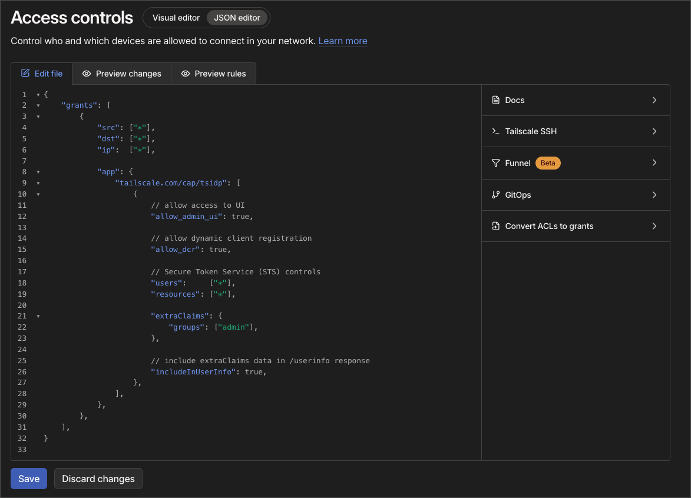
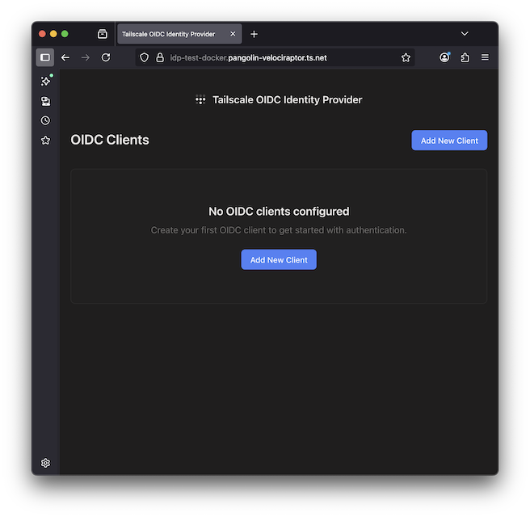
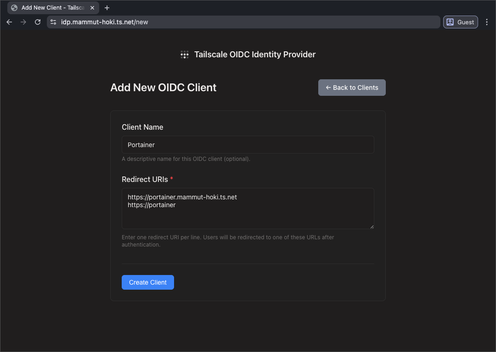
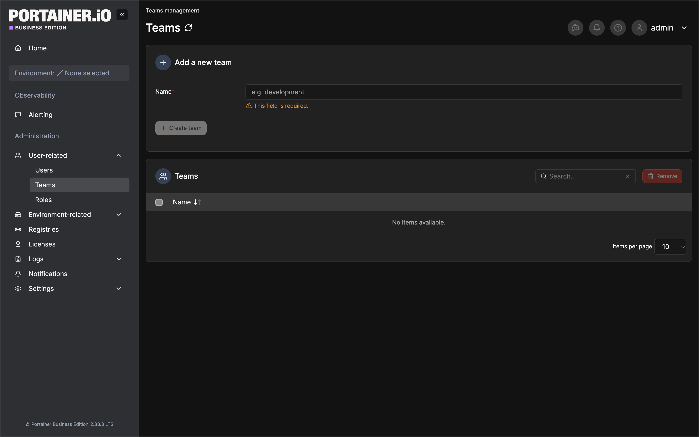
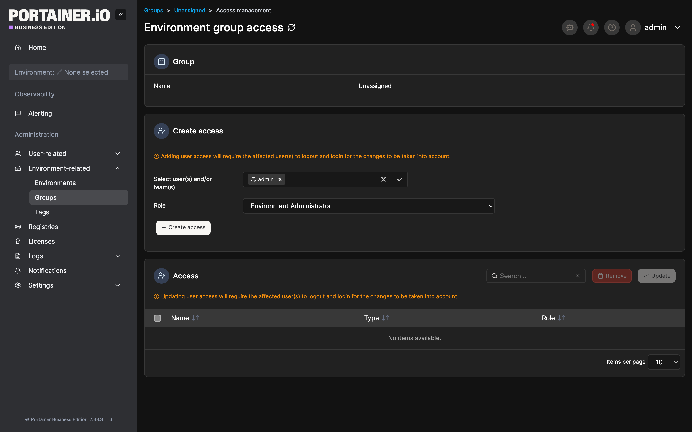
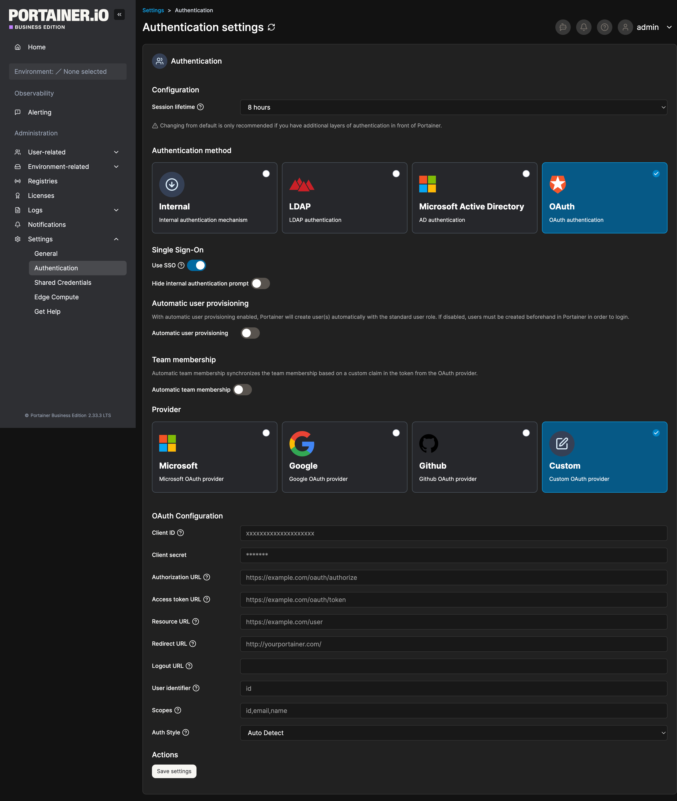
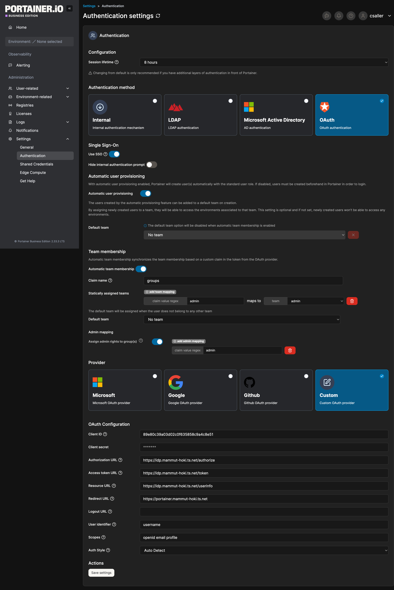
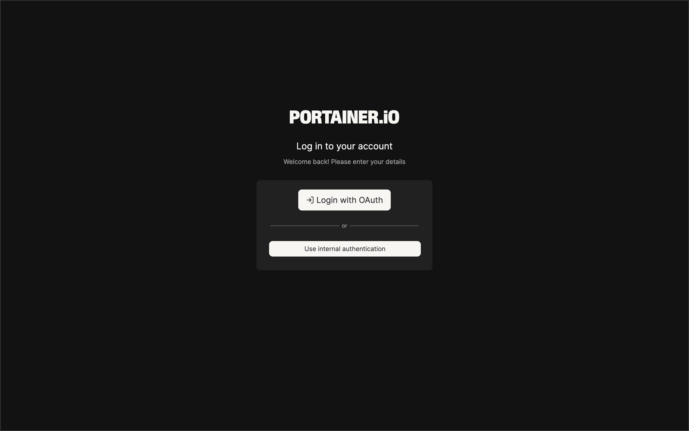

# Portainer setup with tsidp

This doc will cover the OAuth configuration for Portainer using tsidp. If you want a guide on how to setup tsidp, you can check the [Proxmox](../proxmox/README.md) guide.

## Configure Portainer to use tsidp

This example assumes:
- Portainer server: https://portainer.yourtailnet.ts.net:9443
- tsidp instance: https://idp.yourtailnet.ts.net

> NOTE: This guide will use Portainer Business Edition, but the steps can be applied to the Community Edition as well. 


### Add a new claim to the Tailscale Access Control
1. **Visit** `https://login.tailscale.com/admin/acls/file`
2. On the Policy JSON, inside the `tsidp` app, add the following `extraClaims` property:
```json
"extraClaims": {
    "groups": [
        "group_1",
        "group_2",
        ...
    ]
}
```
It is reccomended to map the group names (`group_1`, `group_2`, ...) to groups inside Portainer to ease the setup process
These groups can be created following the policies you already have configured on Tailscale. If you do not have any policies in place, you can create a single group called `admin` and link all the users to this group.


### Register Portainer as a Client in tsidp

1. **Visit** `https://idp.yourtailnet.ts.net` and click "Add New Client"

   
   
2. **Configure the client**:
   - Add redirect URIs for each way you access Proxmox
   - Save the generated Client ID and Client Secret; you'll use these next

   


### Configure the Groups to allow resource access
1. Navigate to User-related → Teams
2. Create a new team. You can call it whatever you want, but, to ease the configuration process, we will call it with the same name we configured on the [Add a new claim to the Tailscale Access Control](#add-a-new-claim-to-the-tailscale-access-control) step.

   

3. Go to **Environment-related** -> **Groups** -> on the `Unassigned` group, click on **Manage access**
4. On the **Create access** section, select the group you just created and the role you want to associate to it.
5. Click on **+ Create access**

   


### Configure OpenID Connect in Portainer

1. **Navigate to** Settings → Authentication → **OAuth**

   

2. **Set the following options:**
   - **Use SSO**: Enabled
   - **Hide internal authentication prompt**: Enabled if you want to force SSO, otherwise, disabled.
   - **Automatic user provisioning**: Enabled
   - **Automatic team membership**: Enabled
   - **Claim name**: `groups` - the same we configured on [Add a new claim to the Tailscale Access Control](#add-a-new-claim-to-the-tailscale-access-control)
   - **Statically assigned teams**: click on the `add team mapping` button
     - **Claim value regex**: `admin` maps to `admin` team
       > This step should be repeated for all the groups created on the [Add a new claim to the Tailscale Access Control](#add-a-new-claim-to-the-tailscale-access-control).
   - **Default team**: No team
   - **Assign admin rights to group(s)**: Enabled
     - **claim value regex**: `admin`

3. **Configure the Custom OAuth provider** with these settings:
   - **Client ID**: (from tsidp)
   - **Client Secret**: (from tsidp)
   - **Authorization URL**: `https://idp.yourtailnet.ts.net/authorize`
   - **Access token URL**: `https://idp.yourtailnet.ts.net/token`
   - **Resource URL**: `https://idp.yourtailnet.ts.net/userinfo`
   - **Redirect URL**: `https://portainer.yourtailnet.ts.net:9443`
   - **Logout URL**: Blank
   - **User identifier**: `username`
   - **Scopes**: `openid email profile`
   - **Auth style**: `Auto Detect`

   


### Test the Authentication

1. **Open an incognito browser window** and navigate to `https://portainer.yourtailnet.ts.net:9443`

2. **Log in with OAuth**
   - Authentication should work immediately
   - Portainer will auto-create a user account (due to "Automatic user provisioning: enabled")
   - You should be able to see all environments configured on your Portainer installation.

   
