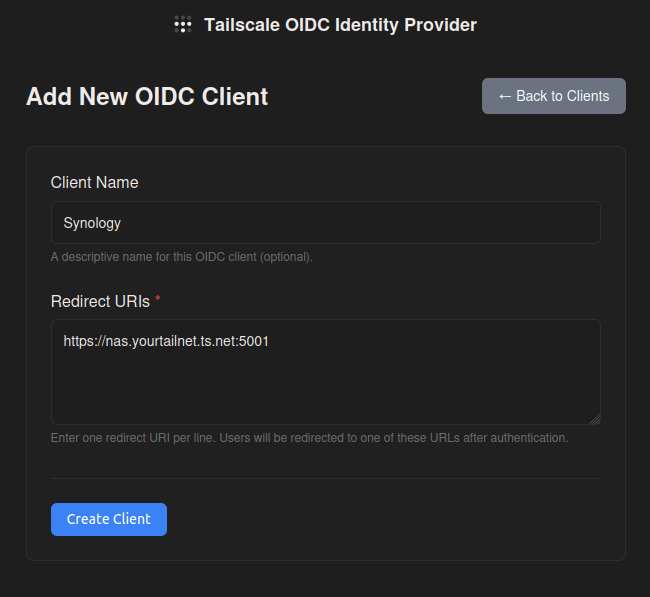
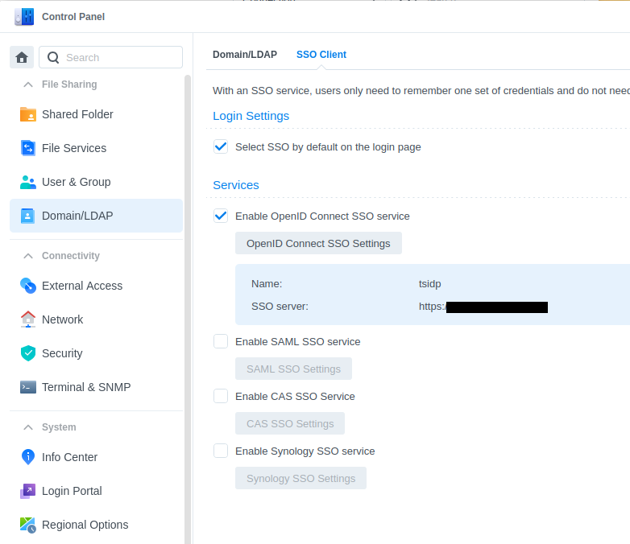
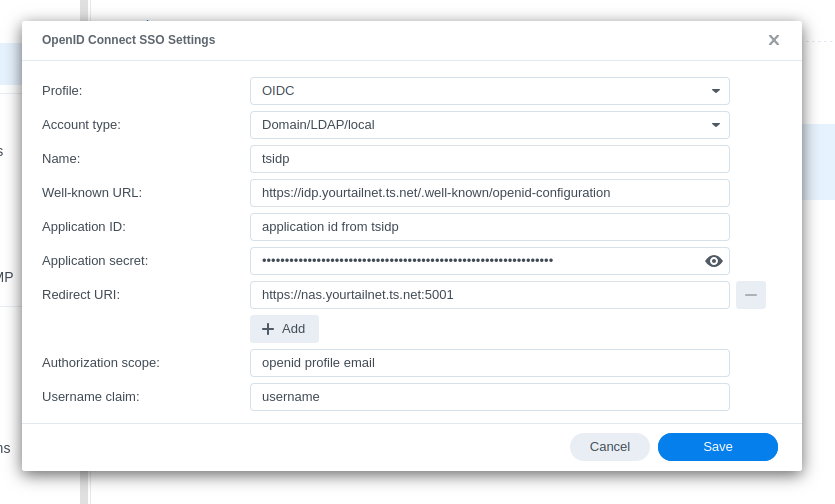

# Synology Setup with tsidp

This section covers:
- Configuring Synology to use an existing tsidp instance for authentication

## Configure Synology to Use tsidp

This example assumes:
- Synology NAS: `https://nas.yourtailnet.ts.net:5001`
- tsidp instance: `https://idp.yourtailnet.ts.net`

### Setup Tailscale on Synology

1. **Install and configure Tailscale** on your Synology NAS
   - Follow the [official Tailscale guide for Synology](https://tailscale.com/kb/1131/synology)
   - Ensure you've completed the hostname configuration steps mentioned in that guide

### Register Synology as a Client in tsidp

1. **Visit** `https://idp.yourtailnet.ts.net` and click "Add New Client"

   

2. **Configure the client**:
   - **Redirect URI**: Synology only appears to support a single redirect URI.
     - `https://nas.yourtailnet.ts.net:5001`
   - Save the generated Client ID and Client Secret

### Configure OpenID Connect in Synology

1. **Navigate to** Control Panel → Domain/LDAP → SSO Client (Tab)

2. **Enable OpenID Connect**:
   - Check the "Enable OpenID Connect SSO service" checkbox
   - Click the "OpenID Connect SSO Settings" button

   

3. **Configure the OpenID Connect settings**:
   - **Profile**: OIDC
   - **Account type**: Domain/LDAP/local
   - **Name**: `tsidp`
   - **Well known URL**: `https://idp.yourtailnet.ts.net/.well-known/openid-configuration`
   - **Application ID**: (from tsidp)
   - **Application secret**: (from tsidp)
   - **Redirect URI**: (the one configured in tsidp)
   - **Authorization scope**: `openid profile email`
   - **Username claim**: `username`

   

4. **Important**: Create Synology user accounts
   - Synology must have a local user account matching your Tailscale username
   - If your Tailscale username is `example@github`, create a Synology user named `example`
   - The OpenID Connect integration will authenticate users but requires matching local accounts

### Test Authentication

1. **Open an incognito browser window** and navigate to `https://nas.yourtailnet.ts.net:5001`

2. **Log in** using Tailscale authentication
   - You should be prompted to authenticate via tsidp
   - After successful authentication, you should be logged into Synology

3. **Close the incognito window**

## Final Verification

Log out of Synology and log back in using Tailscale authentication to verify everything is working correctly.
